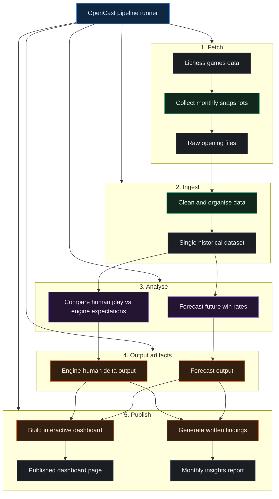

# OpenCast — Chess Opening Analytics

OpenCast is a data pipeline that fetches monthly win-rate snapshots for 20 ECO openings from the Lichess Opening Explorer API, fits per-opening ARIMA time series models to detect structural breaks and forecast future win rates, and computes an engine-human delta score — the gap between Stockfish's theoretical win probability and the actual human win rate at 2000-rated blitz. Unlike a standard win-rate dashboard, OpenCast surfaces *where humans systematically diverge from engine expectation* and *whether those patterns are accelerating or reversing*.

---

## Live Dashboard

[https://coeusyk.github.io/opencast/](https://coeusyk.github.io/opencast/)

Dashboard is published via GitHub Pages on each pipeline run.

---

## Latest Findings

See [FINDINGS.md](FINDINGS.md) — auto-generated monthly by the pipeline.

---

## How It Works

1. **Fetch** — A Rust binary queries `explorer.lichess.ovh` month-by-month for each opening, writing one JSON file per opening per month into `data/raw/`.
2. **Ingest** — Python normalises all JSONs into `data/processed/openings_ts.csv` (780 rows, one per opening × month).
3. **Analyse** — `timeseries.py` fits `auto_arima` models (AIC) per opening, runs Ljung-Box and Chow structural-break tests, and writes 3-month forecasts with 95% CI to `data/output/forecasts.csv`. `engine_delta.py` evaluates each opening with Stockfish at depth 20 and writes the engine-vs-human delta to `data/output/engine_delta.csv`.
4. **Report & Visualise** — `report.py` generates `FINDINGS.md` (LLM-powered via Ollama, with template fallback). `visualizer.py` renders a 3-panel Plotly dashboard: forecast ribbons for the top-5 openings by volume, a bubble chart of engine cp vs human win rate, and an ECO × month win-rate heatmap.

---

## Setup

```bash
git clone https://github.com/coeusyk/opencast.git
cd opencast

# Install Cargo/Rust toolchain if not already installed
command -v cargo >/dev/null 2>&1 || sudo apt install -y cargo rustc

# Create local environment file from template (if needed)
cp -n .env.example .env

# Lichess API token (free at https://lichess.org/account/oauth/token)
export LICHESS_TOKEN=<your_token>

# Gemini API key (optional, for Gemini-generated findings)
export GEMINI_API_KEY=<your_gemini_api_key>

# Build the Rust fetcher
cd fetcher && cargo build --release && cd ..

# Create and activate Python virtual environment with uv
uv venv .venv
source .venv/bin/activate

# Install Python dependencies with uv
uv pip install -r requirements.txt

# Run the full pipeline
python main.py
```

> **Stockfish 16** must be installed separately: `sudo apt install stockfish`

> **Ollama** (optional, for LLM-generated findings): install from [ollama.com](https://ollama.com) and run `ollama pull llama3.1:latest`. If unavailable, `report.py` falls back to templated text.

---

## Data Coverage

| Metric | Value |
|---|---|
| Openings tracked | 20 (ECO A–E) |
| Date range | 2023-01 → 2026-03 (39 months) |
| Raw JSON files | 780 |
| Processed rows | 780 (all total ≥ 500 games) |
| Forecast rows | 840 (780 actual + 60 forecast, 3 months per opening) |
| Total games analysed | ~123 million |

---

## Architecture

See [ARCHITECTURE.md](ARCHITECTURE.md) for full module specifications, data schemas, and mathematical derivations.



---

## Requirements

- **Rust** ≥ 1.75 (stable) — for the Lichess fetcher  
- **Python** ≥ 3.11 — for analytics pipeline  
- **Stockfish 16** — `sudo apt install stockfish` (or set `STOCKFISH_PATH`)  
- **Lichess OAuth token** — free at https://lichess.org/account/oauth/token  
- **Gemini API key** (optional) — set `GEMINI_API_KEY` (for Gemini-generated findings)  
- **Ollama** (optional) — `ollama pull llama3.1:latest` for LLM-generated findings

---

## Repository Structure

```
fetcher/          ← Rust binary (Lichess Explorer → JSON)
src/
  ingest.py       ← JSON → openings_ts.csv
  timeseries.py   ← ARIMA forecasting + break detection
  engine_delta.py ← Stockfish centipawn → win probability delta
  visualizer.py   ← 3-panel Plotly HTML dashboard
data/
  raw/            ← 780 JSON files (gitignored)
  processed/      ← openings_ts.csv
  output/         ← forecasts.csv, engine_delta.csv, dashboard/ (multi-page site)
openings.json     ← 20 ECO codes with UCI move sequences
main.py           ← pipeline orchestrator
```
