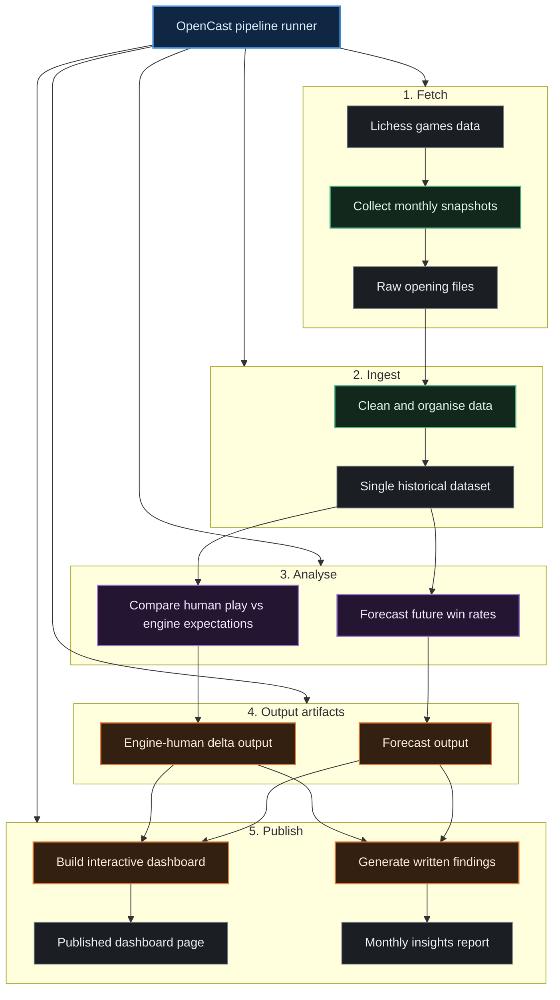

# OpenCast — Chess Opening Analytics

OpenCast is a data pipeline that fetches monthly win-rate snapshots for 20 ECO openings from the Lichess Opening Explorer API, fits per-opening ARIMA time series models to detect structural breaks and forecast future win rates, and computes an engine-human delta score — the gap between Stockfish's theoretical win probability and the actual human win rate at 2000-rated blitz. Unlike a standard win-rate dashboard, OpenCast surfaces *where humans systematically diverge from engine expectation* and *whether those patterns are accelerating or reversing*.

---

## Live Dashboard

[https://coeusyk.github.io/opencast/](https://coeusyk.github.io/opencast/)

Dashboard is published via GitHub Pages on each pipeline run.

---

## Latest Findings

See [FINDINGS.md](FINDINGS.md) — auto-generated monthly by the pipeline.

---

## How It Works

1. **Fetch** — A Rust binary queries `explorer.lichess.ovh` month-by-month for each opening, writing one JSON file per opening per month into `data/raw/`.
2. **Ingest** — Python normalises all JSONs into `data/processed/openings_ts.csv`, one row per opening per month.
3. **Analyse** — `select_openings.py` classifies each ECO into model tiers. `timeseries.py` fits ARIMA (Tier 1) or Holt-Winters (Tier 2) models per opening, runs Ljung-Box and Chow structural-break tests, and writes 3-month forecasts with 95% CI to `data/output/forecasts.csv`. `engine_delta.py` evaluates Tier-1 openings with Stockfish at depth 20 and writes the engine-vs-human delta to `data/output/engine_delta.csv`.
4. **Report & Visualise** — `report.py` generates `FINDINGS.md` (Gemini-powered, with template fallback). `visualizer.py` builds a multi-page static site: an overview with headline insights and 3 Plotly panels, a sortable openings table, ECO family summaries, and per-opening detail pages.

---

## Setup

```bash
git clone https://github.com/coeusyk/opencast.git
cd opencast

# Install Cargo/Rust toolchain if not already installed
command -v cargo >/dev/null 2>&1 || sudo apt install -y cargo rustc

# Create local environment file from template (if needed)
cp -n .env.example .env

# Lichess API token (free at https://lichess.org/account/oauth/token)
export LICHESS_TOKEN=<your_token>

# Gemini API key (optional, for Gemini-generated findings)
export GEMINI_API_KEY=<your_gemini_api_key>

# Build the Rust fetcher
cd fetcher && cargo build --release && cd ..

# Create and activate Python virtual environment with uv
uv venv .venv
source .venv/bin/activate

# Install Python dependencies with uv
uv pip install -r requirements.txt

# Run the full pipeline
python main.py
```

> **Stockfish 16** must be installed separately: `sudo apt install stockfish`

> **Gemini API key** (optional): `GEMINI_API_KEY` in `.env` powers AI-generated findings. `report.py` falls back to templated text if the key is absent.

---

## Data Coverage

| Metric | Value |
|---|---|
| Openings tracked | 20 (ECO A–E) |
| Date range | 2023-01 → present |
| Raw JSON files | one per opening per month (gitignored) |
| Processed rows | one per opening per month (total ≥ 500 games filter applied) |
| Forecast horizon | 3 months ahead per opening, with 95% CI |

---

## Architecture

See [ARCHITECTURE.md](ARCHITECTURE.md) for full module specifications, data schemas, and mathematical derivations.



---

## Requirements

- **Rust** ≥ 1.75 (stable) — for the Lichess fetcher  
- **Python** ≥ 3.11 — for analytics pipeline  
- **Stockfish 16** — `sudo apt install stockfish` (or set `STOCKFISH_PATH`)  
- **Lichess OAuth token** — free at https://lichess.org/account/oauth/token  
- **Gemini API key** (optional) — set `GEMINI_API_KEY` in `.env` (for AI-generated findings)

---

## Repository Structure

```
fetcher/              ← Rust binary (Lichess Explorer → JSON)
src/
  ingest.py           ← JSON → openings_ts.csv + long_tail_stats.csv
  select_openings.py  ← per-ECO tier classification → openings_catalog.csv
  timeseries.py       ← ARIMA (Tier 1) + Holt-Winters (Tier 2) forecasting
  engine_delta.py     ← Stockfish centipawn → win probability delta
  visualizer.py       ← multi-page static site generator
  assets/
    shared.css        ← design tokens + component styles
    nav.js            ← active-link highlight
data/
  raw/                ← one JSON per opening per month (gitignored)
  processed/          ← openings_ts.csv
  openings_catalog.csv ← ECO tier flags (is_tracked_core, model_tier, …)
  output/
    forecasts.csv     ← ARIMA / HW forecasts with confidence intervals
    engine_delta.csv  ← centipawn vs human win rate delta
    long_tail_stats.csv
    dashboard/        ← multi-page static site (GitHub Pages root)
      index.html      ← overview + 3 panels
      openings.html   ← sortable table of all ECOs
      families.html   ← ECO family (A–E) summary
      opening.html    ← single per-opening template (use ?eco=B20)
      assets/         ← shared.css, nav.js, openings_data.json
openings.json         ← 20 ECO codes with UCI move sequences
main.py               ← pipeline orchestrator
```
