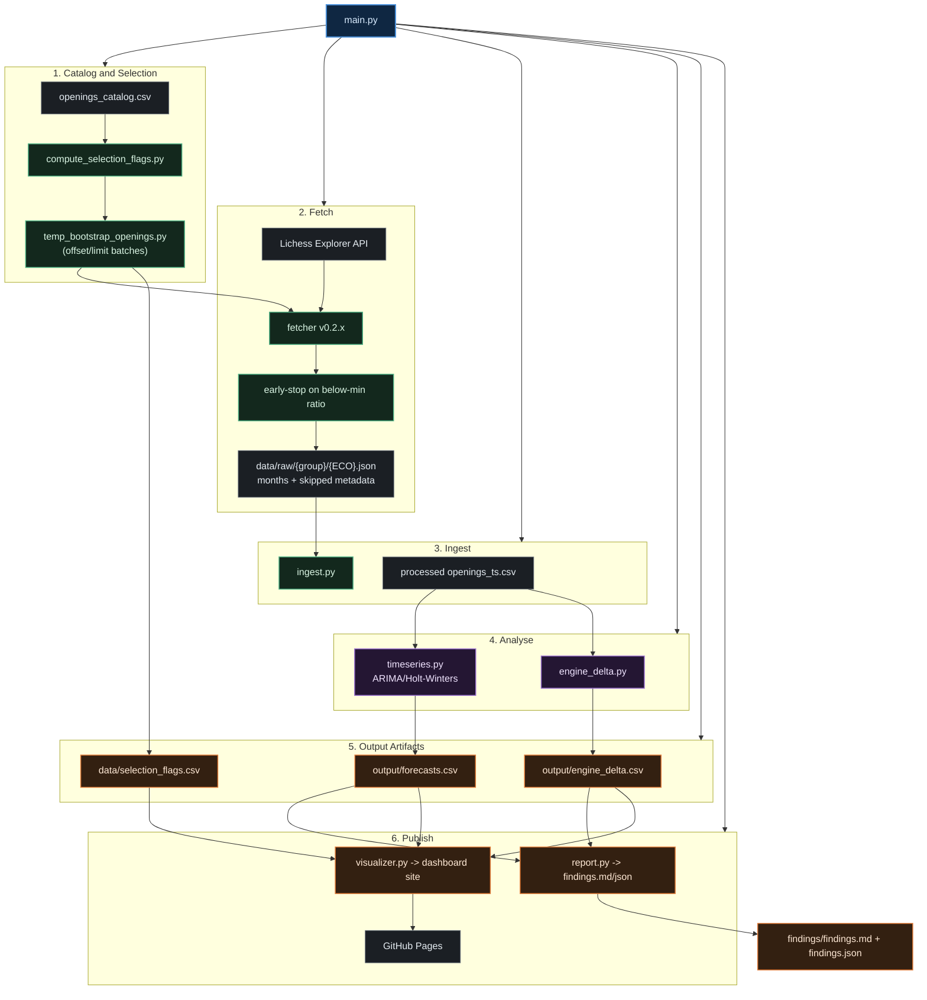

# OpenCast — Chess Opening Analytics

OpenCast is a data pipeline that fetches monthly win-rate snapshots from the Lichess Opening Explorer API, builds per-opening time series, forecasts future win rates, and computes an engine-human delta score - the gap between Stockfish expectation and observed human results at 2000-rated blitz. Unlike a simple leaderboard, OpenCast highlights where humans systematically diverge from engine expectation and whether those gaps are widening or narrowing.

---

## Live Dashboard

[https://coeusyk.github.io/opencast/](https://coeusyk.github.io/opencast/)

Dashboard is published via GitHub Pages on each pipeline run.

---

## Latest Findings

See [findings/findings.md](findings/findings.md) and [findings/findings.json](findings/findings.json) - auto-generated by the pipeline.

## Recent Product Updates

- Opening detail pages now include an **Analysis** section, trend-driver table polish, and an upgraded **Engine vs Human** card layout.
- Trend-line rendering is restored across opening charts, with confidence-based opacity.
- Structural-break vertical markers were removed from per-opening charts to reduce clutter.
- Track 3 foundation is now in place:
  - Curated opening lines live in `data/opening_lines.json`.
  - `run_visualizer()` copies lines to `data/output/dashboard/assets/opening_lines.json`.
  - Opening pages can render an interactive board with start/back/next controls when a curated line is available.
  - Board coordinate labels render outside the board frame (not over piece squares).


## How It Works

1. **Catalog & Selection** - `scripts/build_catalog.py` maintains the full ECO catalog (`data/openings_catalog.csv`). `src/select_openings.py` and `scripts/compute_selection_flags.py` classify openings into Tier 1/2/3 from coverage and activity thresholds.
2. **Fetch (Rust)** - `fetcher` queries `explorer.lichess.ovh` month-by-month and stores one consolidated JSON per ECO at `data/raw/{group}/{ECO}.json` (e.g. `data/raw/A/A00.json`) with `months` and `_meta.skipped_months`.
3. **Bootstrap Expansion** - `scripts/temp_bootstrap_openings.py` activates selected ECO batches, fetches missing months ECO-by-ECO, applies early-stop/coverage pruning, and persists fetch completion tracking (`bootstrap_fetch_complete`, `bootstrap_fetched_until`, `bootstrap_fetch_status`) in the catalog.
4. **Freshness Guard (main.py)** - `main.py` detects missing complete months from `config.json::fetch_start` through the latest complete month, and can auto-fetch when `AUTO_FETCH_MISSING_DATA=true`. In non-interactive runs (CI), fetch is disabled unless explicitly enabled.
5. **Ingest** - `src/ingest.py` normalizes consolidated raw files into `data/processed/openings_ts.csv`.
6. **Analyze** - `src/timeseries.py` fits ARIMA (Tier 1) and Holt-Winters (Tier 2), then writes forecasts to `data/output/forecasts.csv`. `src/engine_delta.py` computes engine-human deltas in `data/output/engine_delta.csv` and skips malformed SAN move tokens instead of aborting the whole stage.
7. **Report & Visualize** - `src/report.py` writes `findings/findings.md` and `findings/findings.json` (Gemini-assisted with template fallback). `src/visualizer.py` generates the static dashboard site in `data/output/dashboard/`, including tier tags on opening detail pages.

---

## Setup

```bash
git clone https://github.com/coeusyk/opencast.git
cd opencast

# Install Cargo/Rust toolchain if not already installed
command -v cargo >/dev/null 2>&1 || sudo apt install -y cargo rustc

# Create local environment file from template (if needed)
cp -n .env.example .env

# Lichess API token (free at https://lichess.org/account/oauth/token)
export LICHESS_TOKEN=<your_token>

# Gemini API key (optional, for Gemini-generated findings)
export GEMINI_API_KEY=<your_gemini_api_key>

# Groq API key (optional, for fast LLM inference)
export GROQ_API_KEY=<your_groq_api_key>

# Build the Rust fetcher
cd fetcher && cargo build --release && cd ..

# Create and activate Python virtual environment with uv
uv venv .venv
source .venv/bin/activate

# Install Python dependencies with uv
uv pip install -r requirements.txt

# Run the full pipeline
python main.py

# Optional: force non-interactive mode to skip auto-fetch prompts
AUTO_FETCH_MISSING_DATA=false python main.py

# Optional: run remaining bootstrap openings after an initial batch
python scripts/temp_bootstrap_openings.py --apply --eco-offset 240
```

> **Stockfish 16** must be installed separately: `sudo apt install stockfish`

> **Gemini API key** (optional): `GEMINI_API_KEY` in `.env` powers AI-generated findings. `report.py` falls back to templated text if the key is absent.

> **Groq API key** (optional): `GROQ_API_KEY` in `.env` enables fast LLM inference as an alternative backend.

---

## Data Coverage

| Metric | Value |
|---|---|
| Catalog size | 498 ECO codes |
| Tracking scope | ECO A-E, tiered by activity/coverage |
| Date range | 2023-01 → present |
| Raw JSON files | one consolidated file per ECO in `data/raw/{A-E}/{ECO}.json` |
| Processed rows | one row per ECO-month in `data/processed/openings_ts.csv` |
| Forecast horizon | 3 months ahead per opening, with 95% CI |

---

## Architecture

See [ARCHITECTURE.md](ARCHITECTURE.md) for full module specifications, data schemas, and mathematical derivations.



---

## Requirements

- **Rust** ≥ 1.75 (stable) — for the Lichess fetcher  
- **Python** ≥ 3.11 — for analytics pipeline  
- **Stockfish 16** — `sudo apt install stockfish` (or set `STOCKFISH_PATH`)  
- **Lichess OAuth token** — free at https://lichess.org/account/oauth/token  
- **Gemini API key** (optional) — set `GEMINI_API_KEY` in `.env` (for AI-generated findings)
- **Groq API key** (optional) — set `GROQ_API_KEY` in `.env` (for fast LLM inference)

---

## Repository Structure

```
fetcher/              ← Rust binary (Lichess Explorer → JSON)
src/
  ingest.py           ← consolidated raw JSON → openings_ts.csv
  select_openings.py  ← per-ECO tier classification → openings_catalog.csv
  timeseries.py       ← ARIMA (Tier 1) + Holt-Winters (Tier 2) forecasting
  engine_delta.py     ← Stockfish centipawn → win probability delta
  report.py           ← findings/findings.md + findings/findings.json
  visualizer.py       ← multi-page static site generator
  assets/
    shared.css        ← design tokens + component styles
    nav.js            ← active-link highlight
scripts/
  build_catalog.py          ← build/refresh full ECO catalog
  compute_selection_flags.py ← tier flags + pruning
  clean_raw_json.py         ← normalize/reformat consolidated raw JSON files
  temp_bootstrap_openings.py ← batch bootstrap fetch with offset/limit and tracking
  migrate_raw.py            ← legacy raw format migration helper
data/
  raw/                ← grouped ECO JSON files at raw/{A-E}/{ECO}.json (gitignored)
  processed/          ← openings_ts.csv
  openings_catalog.csv ← ECO tier flags (is_tracked_core, model_tier, …)
  opening_lines.json  ← curated canonical lines per ECO for interactive board playback
  selection_flags.csv ← per-ECO coverage/tier diagnostics
  output/
    move_stats.csv    ← per-move monthly stats (generated locally/CI, not versioned)
    forecasts.csv     ← ARIMA / HW forecasts with confidence intervals
    engine_delta.csv  ← centipawn vs human win rate delta
    long_tail_stats.csv ← Tier-3 coverage and descriptive opening stats
    dashboard/        ← multi-page static site (GitHub Pages root)
      index.html      ← overview + 3 panels
      openings.html   ← sortable table of all ECOs
      families.html   ← ECO family (A–E) summary
      opening.html    ← single per-opening template with tier badge (use ?eco=B20)
      assets/         ← shared.css, nav.js, openings_data.json, opening_lines.json
findings/
  findings.md         ← narrative findings report
  findings.json       ← structured findings payload
  narratives.json     ← per-opening generated narrative cache
openings.json         ← seed opening definitions (legacy bootstrap input)
main.py               ← pipeline orchestrator
```

---

## CI / Automation Notes

- `.github/workflows/update.yml` fetches missing months incrementally, then runs a full recomputation by clearing generated artifacts and executing `AUTO_FETCH_MISSING_DATA=false python main.py`.
- Processing commits include refreshed `data/processed/openings_ts.csv`, `data/output/*.csv`, dashboard pages, and `findings/` artifacts.
